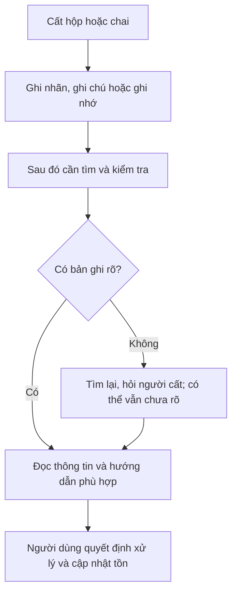
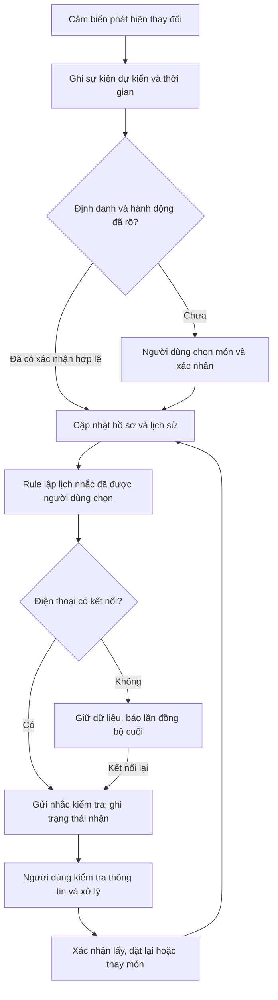

# 02.3 — Workflow, metric và Problem Statement: FreshBox

## 1. Actor và phạm vi

Actor đề xuất: người trực tiếp cất và quản lý thực phẩm trong một tủ lạnh gia đình hoặc nhà ở chung. Cần xác nhận phân khúc qua phỏng vấn.

MVP giới hạn ở **một vùng theo dõi với một vật phẩm tại một thời điểm**. Mỗi vật phẩm có ID do người dùng xác nhận. Khung rộng chứa nhiều vật phẩm trong ảnh là hướng sản phẩm; chưa giả định một cảm biến chung phân biệt được tất cả món.

## 2. Current workflow — cần quan sát thực tế

| Bước | Actor | Input | Output | Thời gian/tần suất | Điểm cần quan sát |
|---|---|---|---|---|---|
| 1. Cất thực phẩm | Người dùng | Hộp/chai và thông tin nhãn | Món nằm trong tủ | Chưa đo | Ngày nấu/mở có thể trước ngày cất |
| 2. Ghi nhớ/ghi nhãn | Người dùng | Thông tin mình biết | Nhãn/ghi chú hoặc trí nhớ | Chưa đo | Có ghi nhận không, ghi mốc nào? |
| 3. Tra cứu khi cần | Người dùng/thành viên khác | Nhu cầu tìm món hoặc thông tin | Tìm, đọc nhãn, hỏi người cất | Chưa đo | Điểm nghẽn giả định: tái dựng thông tin đã mất |
| 4. Quyết định xử lý | Người dùng | Nhãn, điều kiện bảo quản, thông tin liên quan | Quyết định cách xử lý | Chưa đo | Không coi hình thức món là chứng nhận an toàn |
| 5. Cập nhật tồn | Người lấy/cất | Hành động sử dụng/di chuyển | Ghi chú hoặc danh sách được sửa | Chưa đo | Có người khác dùng tủ, đổi món hay không? |

## 3. Future workflow — Rule/IoT

| Bước | Xử lý | Input → output | Trách nhiệm |
|---|---|---|---|
| 1. Phát hiện thay đổi | Cảm biến + lọc sự kiện | Tín hiệu → sự kiện có mốc thiết bị | Chưa coi là đã biết đúng món |
| 2. Xác nhận vật phẩm | Người dùng | Sự kiện → ID mới/cũ, mốc đã biết, trạng thái chưa rõ | Người dùng sửa nếu hệ thống hiểu sai |
| 3. Lưu và lên lịch | Rule | Hồ sơ đã xác nhận → lịch sử và mốc nhắc | Tách mốc cất/mở/nhãn/nhắc; không tự suy hạn |
| 4. Nhắc kiểm tra | Rule + kết nối điện thoại | Lịch nhắc → thông báo có trạng thái gửi/nhận | Báo lần đồng bộ cuối khi ngoại tuyến |
| 5. Xử lý và cập nhật | Người dùng + cảm biến | Lấy/đặt lại/thay món → sự kiện và trạng thái | Không tự coi lấy ra là đã ăn; không reset mốc cũ |

Nếu không biết thời gian do mất nguồn/đồng hồ: giữ “mốc chưa xác định” và yêu cầu bổ sung; không bịa timestamp. Mất mạng chỉ có thể đồng bộ lại phần dữ liệu thiết bị thực sự lưu được.

## 4. Trường dữ liệu và ranh giới

| Trường | Nguồn và ý nghĩa |
|---|---|
| ID vật phẩm/vùng | Người dùng xác nhận; không dùng trọng lượng làm danh tính |
| Thời điểm cất lần đầu đã biết | Cảm biến đề xuất; người dùng sửa khi món đã được cất từ trước |
| Thời điểm mở/chế biến nếu biết | Người dùng nhập; không suy từ thao tác lấy/đặt |
| Nội dung ngày/hướng dẫn trên nhãn | Người dùng nhập; OCR chỉ gợi ý ở nhánh mở rộng |
| Mốc nhắc | Người dùng chọn; là lịch nhắc kiểm tra, không phải chứng nhận hạn an toàn |
| Sự kiện lấy/đặt lại và lần đồng bộ cuối | Log thực tế, giữ lịch sử và trạng thái tin cậy |
| Trạng thái | Chờ xác nhận / đang theo dõi / ra khỏi vùng / đã kết thúc theo xác nhận |

AI không được quyết định “ăn được”, tự kéo dài mốc sử dụng hoặc thay thế thông tin nhãn. Xem [căn cứ về bảo quản](02-validation-and-research.md).

## 5. Metric — mục tiêu đề xuất, chưa có kết quả

| Chỉ số | Baseline | Mục tiêu thử nghiệm | Cách đo |
|---|---|---|---|
| Ghi nhận sự kiện cất/lấy | Chưa đo | Phát hiện ≥95% sự kiện hợp lệ; lỗi trùng/giả ≤5% số bản ghi | So với người quan sát/video có mốc; không chỉ đếm log hệ thống |
| Bản ghi đúng ID và giờ sau xác nhận | Chưa đo | ≥95% lượt cất đúng ID, sai số giờ ≤5 giây khi đồng hồ đã đồng bộ | Kiểm cả phát hiện, ID và timestamp; lượt không có log là thất bại |
| Lấy rồi đặt lại cùng món | Chưa đo | 0 lần tự reset mốc gốc trong tập thử | So hồ sơ trước/sau; ghi riêng sự kiện quay lại |
| Công ghi/xác nhận một món | Chưa đo nhãn/app | Trung vị ≤10 giây và giảm ≥30% so với nhập app thủ công | Tính cả chọn ID, sửa lỗi và mở app; không chỉ tính thời gian cảm biến |
| Tra thông tin một món | Chưa đo cách hiện tại | Trung vị ≤15 giây và giảm ≥30% so với cách hiện tại | Bắt đầu từ yêu cầu tìm đến khi có thông tin đúng |
| Nhắc đến điện thoại | Chưa đo | ≥95% nhắc nhận trong 60 giây từ mốc hẹn khi kết nối bình thường | Đối chiếu trên điện thoại; gửi lên máy chủ chưa tính là đã nhận |
| Thông tin không biết | Chưa đo | 0 lần tự điền ngày mở/hạn dùng hoặc báo an toàn không có căn cứ | Rà dữ liệu và thông báo trong toàn bộ tập thử |
| Tương thích, pin, nhiệt độ | Chưa đo | Chưa chốt ngưỡng số khi chưa có kích thước tủ và phần cứng | Đo vật lý, điện năng, đồng bộ; không suy tuổi thọ pin từ ảnh |
| Giảm bỏ quên/lãng phí | Chưa có nhật ký hộ gia đình | Chỉ theo dõi thăm dò, chưa hứa phần trăm giảm | Nhật ký trước/sau, số món và lý do bỏ; không thử ăn đồ đáng ngờ |

Giảm thời gian = (trung vị đối chứng − trung vị FreshBox) / trung vị đối chứng. Báo cỡ mẫu, lỗi và lượt chưa hoàn tất; pilot nhỏ không cho phép khái quát hiệu quả cho mọi gia đình.

**Before/after:** cả hai workflow có khoảng 5 bước chính; lợi ích cần chứng minh nằm ở độ đầy đủ dữ liệu và công người dùng, không phải số bước ít hơn.

## 6. Problem Statement v0 — diễn đạt từ ý tưởng đầu vào

| Field | Nội dung |
|---|---|
| Actor | Người dùng cất thực phẩm và đồ uống trong tủ lạnh |
| Workflow | Cất → nhớ/ghi → tìm/kiểm tra → sử dụng hoặc xử lý |
| Bottleneck | Không có thông tin thuận tiện về lúc cất |
| Impact | Có nguy cơ quên món và tốn công tìm thông tin; chưa đo |
| Success Metric | Mong muốn ghi nhận và nhắc qua điện thoại; cần cụ thể hóa |
| Boundary | Ban đầu chưa phân biệt theo dõi thời gian với đánh giá độ an toàn |

## 7. Problem Statement v1 — bản phân tích đã thu hẹp

| Field | Nội dung |
|---|---|
| Actor | Người trực tiếp quản lý thực phẩm trong một tủ lạnh, đồng ý thử một vùng theo dõi; chưa xác nhận phân khúc bằng phỏng vấn |
| Workflow | Cất món → cảm biến ghi sự kiện → người dùng xác nhận ID/mốc → lưu và nhắc kiểm tra → cập nhật lấy/đặt lại |
| Bottleneck | Thiếu bản ghi tại thời điểm cất và công duy trì danh sách khiến thông tin cần tra lại không đáng tin |
| Impact | Công ghi/tra cứu và số món bị bỏ quên; chưa có baseline hoặc số liệu tổn thất |
| Success Metric | Ghi đúng ≥95%; công xác nhận ≤10 giây và giảm ≥30% so với app; tra cứu ≤15 giây; không reset mốc cùng món; các điều kiện đo ở bảng metric |
| Boundary | Một vật phẩm/vùng; xác nhận danh tính và mốc; không bảo đảm ăn an toàn; không tự suy ngày mở/hạn; giữ trạng thái chưa rõ khi thiếu dữ liệu |
| AI intervention point | Chỉ ở nhánh mở rộng đọc tên/nội dung nhãn từ ảnh do người dùng cung cấp, trước bước xác nhận |
| Mức chọn | Rule/IoT cho MVP; Workflow có AI được so sánh riêng sau |
| Rủi ro và người kiểm tra | Nhầm món, mất log, cảnh báo sai, thiết bị không vừa; người dùng review hồ sơ, người thử nghiệm đối chiếu log và kiểm phần cứng |

v0/v1 là hai phiên bản phân tích từ tư liệu nhóm và research, không giả là kết quả hai vòng phỏng vấn đã xảy ra.
