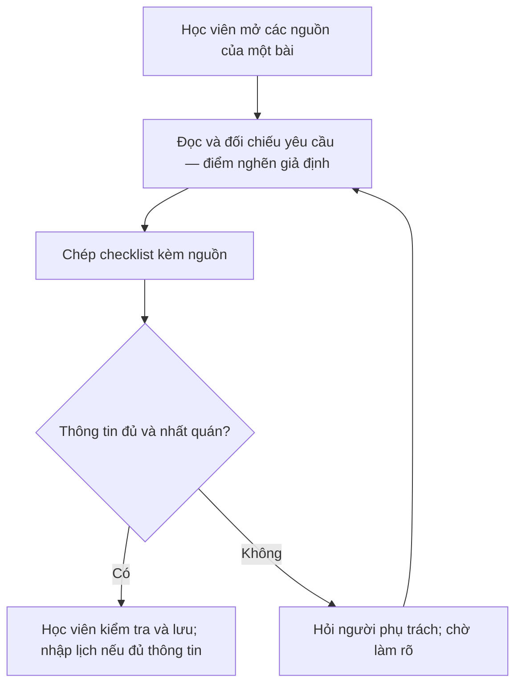
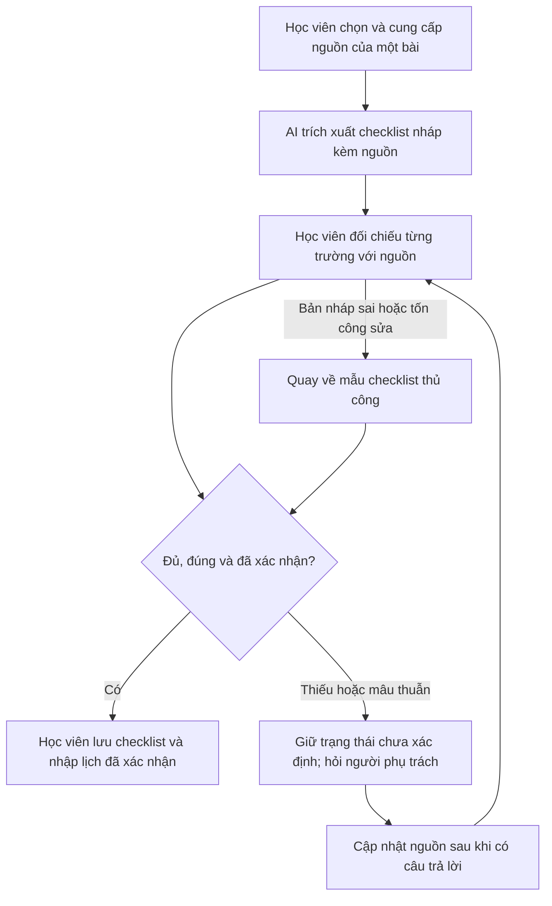

# 02.3 — Workflow và Problem Statement

> **Bản phân tích đề xuất; chưa được kiểm chứng hoặc thông qua bởi nhóm.** v0/v1 thể hiện hai mức hoàn thiện của bản nháp. Chưa có dữ liệu phỏng vấn để khẳng định sự thay đổi của vấn đề trong thực tế.

## 1. Phạm vi và người dùng

Người dùng mục tiêu đề xuất là học viên phải kết hợp thông tin ở nhiều nguồn để hiểu đủ một bài tập. Một lần xử lý giới hạn ở **một bài, tối đa ba văn bản nguồn do học viên chọn và cung cấp**, không bao gồm tự truy cập toàn bộ tài khoản học tập.

Đầu ra cần có: tên bài, sản phẩm cần nộp, tiêu chí bắt buộc, thời hạn nếu nguồn có nêu, nơi nộp, đoạn/đường dẫn nguồn và tình trạng đã xác nhận hay còn thiếu thông tin.

## 2. Current workflow cần xác nhận

| Bước | Actor | Input | Output | Thời gian/tần suất | Bàn giao/điểm cần quan sát |
|---|---|---|---|---|---|
| 1. Mở các nguồn | Học viên | Thông báo có bài hoặc sửa đề | Tập nguồn cần đọc | Chưa đo; mỗi bài/lần cập nhật | Cần biết nguồn nào đang có hiệu lực |
| 2. Đọc và đối chiếu | Học viên | Đề bài, tài liệu, thông báo bổ sung | Các yêu cầu và chỗ chưa thống nhất | Chưa đo | Điểm nghẽn giả định: liên kết thông tin rải rác |
| 3. Chép checklist | Học viên | Các yêu cầu đã tìm | Checklist nháp có nguồn | Chưa đo | Có thể bỏ sót yêu cầu hoặc chép sai |
| 4. Xác nhận chỗ chưa rõ | Học viên; người phụ trách nếu cần | Checklist và câu hỏi | Checklist đã đối chiếu; câu hỏi còn mở | Chưa đo cả thao tác và thời gian chờ | Người phụ trách làm rõ khi nguồn không đủ |
| 5. Lưu và lập lịch | Học viên | Checklist đã duyệt | Danh sách công việc và lịch nếu đủ ngày/giờ | Chưa đo | Học viên tự lưu và chịu trách nhiệm xác nhận |

## 3. Future workflow đề xuất

| Bước | Cách xử lý | Input → output | Ai xác nhận? |
|---|---|---|---|
| 1. Chọn nguồn và phiên bản | Học viên | Văn bản, link, thời điểm/phiên bản nếu biết → tập input cho một bài | Học viên |
| 2. Tạo checklist nháp | AI trong workflow cố định | Input → các trường có đoạn nguồn; thiếu/mâu thuẫn được đánh dấu | Chưa được coi là thông tin đã duyệt |
| 3. Đối chiếu và giải quyết chỗ chưa rõ | Học viên, người phụ trách khi cần | Bản nháp → bản đã kiểm hoặc trạng thái chờ xác nhận | Học viên chịu trách nhiệm review |
| 4. Lưu và nhập lịch | Học viên dùng mẫu cố định | Bản đã duyệt → checklist lưu lại và mục lịch nếu đủ thông tin | Học viên thực hiện thao tác cuối |

Các bước định dạng trường, kiểm tra ô bắt buộc và đánh dấu trạng thái có thể dùng rule/template. Việc hiểu văn bản và gợi ý cấu trúc là phần thử AI. Bản lab mô tả thiết kế, chưa xây hoặc tích hợp hệ thống.

**Bottleneck mới có thể có:** con người review nguồn và giải quyết mâu thuẫn. Chưa biết tổng thời gian có giảm; phải tính cả bước này trong pilot. Nếu nguồn không đủ, workflow giữ trạng thái chờ, không tự hoàn tất.

## 4. Before/after và cách đo

| Chỉ số | Hiện trạng | Phương án sau | Cách kiểm tra |
|---|---|---|---|
| Số bước chính theo thiết kế | 5 | 4, có nhánh ngoại lệ | Đối chiếu thực tế; không suy ra tiết kiệm từ số bước |
| Tổng thời gian | Chưa đo | Mục tiêu trung vị ≤10 phút/lượt hoàn tất | Bấm giờ từ mở nguồn đến lưu xong; ghi riêng thời gian chờ |
| So với phương án đơn giản | Chưa đo template thủ công | Mục tiêu giảm ≥30% thời gian trung vị so với template | Dùng nhiệm vụ tương đương; tính cả nhập nguồn, review, sửa và lưu |
| Hạn nộp sai sau review | Chưa đo | Mục tiêu 0 trường hợp trong tập pilot | So với nguồn đã xác nhận; thiếu ngày/giờ phải ghi thiếu |
| Yêu cầu bắt buộc được ghi đúng | Chưa đo | Mục tiêu ≥95% trên tập pilot | Số yêu cầu đúng trong checklist / tổng yêu cầu theo đáp án |
| Yêu cầu không có căn cứ trong checklist đã duyệt | Chưa đo | Mục tiêu 0 trên tập pilot | Kiểm mọi yêu cầu đã thêm; không chỉ tính độ bao phủ |
| Lượt chưa giải quyết được nguồn mâu thuẫn | Chưa đo | Ghi đầy đủ số lượt và lý do | Không loại âm thầm các lượt này khỏi báo cáo thời gian |
| Rủi ro mới | Lỗi đọc/chép của người | AI có thể bịa trường, lấy nhầm phiên bản hoặc bỏ sót | Lưu lỗi trước và sau review; không chỉ báo cáo bản đã sửa |

Các ngưỡng là đề xuất thiết kế cho thử nghiệm nhỏ, cần nhóm xem xét lại sau khi có baseline. Không diễn giải "0 lỗi trong pilot" thành bảo đảm không bao giờ sai.

## 5. Problem Statement v0 — bản đề xuất ban đầu

| Field | Nội dung |
|---|---|
| Actor | Học viên quản lý bài tập nhận qua nhiều nguồn. |
| Workflow | Mở nguồn → đọc/đối chiếu → chép checklist → xác nhận → lưu và lập lịch. |
| Bottleneck | Giả định bước đọc và tổng hợp yêu cầu đang tốn công; chưa xác nhận bằng quan sát. |
| Impact | Có thể làm chậm việc bắt đầu bài và tạo rủi ro nộp thiếu; chưa có bằng chứng về tần suất hoặc mức độ. |
| Success Metric | Đo thời gian đến checklist đã kiểm, tỷ lệ yêu cầu đúng và lỗi deadline; baseline chưa có. |
| Boundary | Chỉ hỗ trợ hiểu và tổ chức yêu cầu; học viên xác nhận thông tin và tự nộp bài. |

## 6. Problem Statement v1 — thu hẹp sau nghiên cứu tài liệu

| Field | Nội dung |
|---|---|
| Actor | Học viên có một bài tập cần đối chiếu ít nhất hai nguồn; loại khỏi phạm vi trường hợp một lịch/LMS đã cung cấp đầy đủ. Điều kiện này cần xác nhận qua phỏng vấn. |
| Workflow | Cung cấp tối đa ba văn bản của một bài → trích checklist có nguồn → review và hỏi chỗ chưa rõ → lưu và lập lịch nếu đủ thông tin. |
| Bottleneck | Giả thuyết tập trung vào chuyển các yêu cầu bằng văn bản thành checklist nhất quán, thay vì chỉ nhắc deadline. |
| Impact | Chi phí đọc, chép, kiểm tra và sửa checklist; đo trực tiếp trước khi khẳng định tác động. |
| Success Metric | Đề xuất trung vị ≤10 phút và giảm ≥30% so với template không AI; ≥95% yêu cầu bắt buộc được ghi đúng; không có deadline sai hoặc yêu cầu bịa trong bản đã duyệt của tập pilot. |
| Boundary | Một bài/tối đa ba nguồn; không đoán ngày/giờ, không tự quyết mâu thuẫn, không đọc tài khoản tự động, không tự gửi hoặc nộp bài; học viên duyệt trước khi lưu lịch. |
| AI intervention point | Sau khi học viên chọn nguồn, trước khi đối chiếu checklist nháp. |
| Mức chọn đề xuất | Workflow có một bước AI; template/rule cho cấu trúc; người dùng review. Chưa có cơ sở cần Agent tự lập kế hoạch. |
| Rủi ro và kiểm tra | Bỏ sót, nhầm phiên bản, bịa deadline; học viên đối chiếu từng trường với nguồn, hỏi người phụ trách nếu chưa rõ, quay về nhập tay nếu không đáng tin. |

**Lý do thay đổi:** nghiên cứu cho thấy đã có các phương án lưu nhiệm vụ và xem deadline; vì vậy bản nháp giới hạn vào công đọc và đối chiếu nguồn. Đây là suy luận từ [research](02-validation-and-research.md), chưa phải kết luận từ phỏng vấn.

## 7. Những mục phải cập nhật sau kiểm chứng

- Học viên mục tiêu và ví dụ bài thật.
- Workflow thực tế, thời gian từng bước và điểm nghẽn quan sát được.
- Baseline và ngưỡng mục tiêu được nhóm chấp nhận.
- Tín hiệu phản bác giả thuyết; thay đổi scope nếu cách không AI đã đủ.
- Người review, người phụ trách làm rõ nguồn và quyết định cuối của nhóm.
