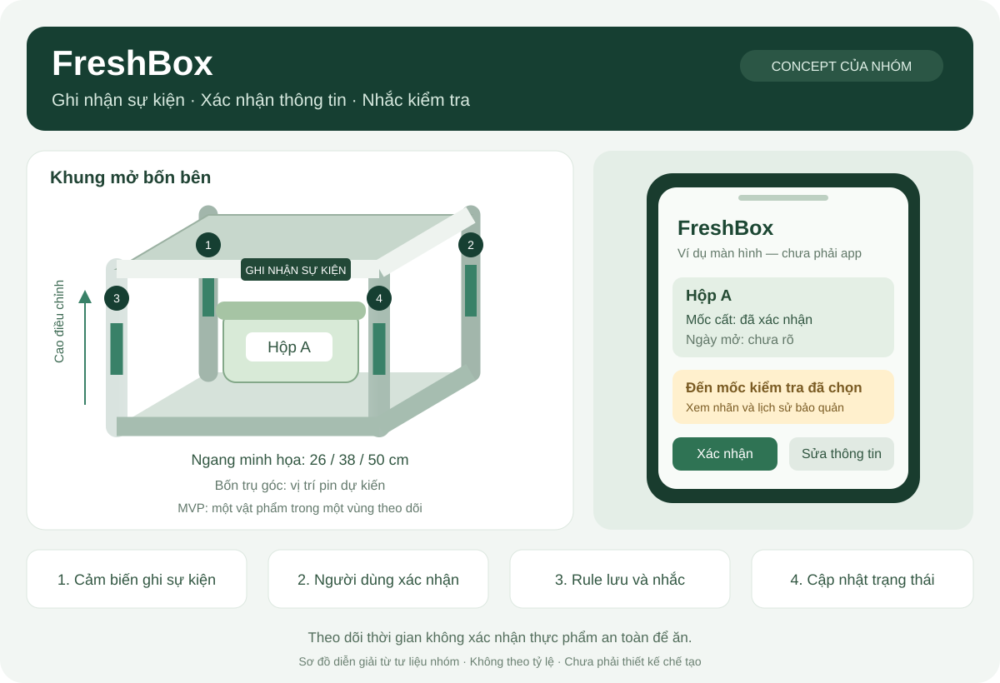
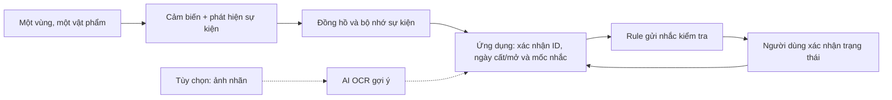

# 02.6 — Hồ sơ concept FreshBox

## 1. Ý tưởng của nhóm

FreshBox là khung dạng hộp mở bốn bên đặt trên ngăn tủ lạnh. Khi người dùng đặt thực phẩm/đồ uống vào vùng theo dõi, hệ thống dự kiến ghi mốc sự kiện, liên kết với một vật phẩm và cho xem/nhắc qua điện thoại.



Sơ đồ là bản diễn giải của trợ lý từ ý tưởng nhóm; không theo tỷ lệ và không phải bản vẽ chế tạo.

## 2. Các chi tiết từ ba ảnh

| Chi tiết | Nguồn | Trạng thái |
|---|---|---|
| Khung mở bốn bên; theo dõi lúc đặt đồ và nhắc điện thoại | Ảnh 1 | Yêu cầu concept do nhóm cung cấp |
| Ba chiều ngang 26, 38, 50 cm | Ảnh 2 | Số trên hình minh họa; chưa được kiểm bằng tủ thật |
| Chiều cao điều chỉnh | Ảnh 2 | Chưa chốt khoảng điều chỉnh |
| Pin đặt trong bốn trụ góc | Ảnh 3 | Vị trí dự kiến; chưa chốt kiến trúc nguồn |
| Tên FreshBox / Smart Fridge Box | Các ảnh | Tên làm việc của sản phẩm |

Chiều sâu, tải tối đa, chống ẩm, cách vệ sinh, giá bán, loại cảm biến, thời lượng pin và độ chính xác đều **chưa có thông số được xác nhận**.

## 3. Kiến trúc đề xuất cho MVP



Thiết kế chức năng bổ sung của trợ lý:

- Có thể thử cảm biến hiện diện hoặc tải để phát hiện thay đổi; lựa chọn cuối dựa trên phép đo.
- Sự kiện cảm biến không tự xác định tên thực phẩm hoặc chất lượng. Người dùng gắn ID và xác nhận thay đổi.
- Món nhiều vị trí cần các vùng có khả năng phân biệt hoặc thao tác xác nhận phù hợp; chưa nằm trong MVP một vùng.
- Mỗi hồ sơ giữ mốc ban đầu đã xác nhận; lấy ra/đặt lại chỉ thêm lịch sử.
- Khi mất kết nối, hiển thị thời điểm cập nhật cuối và trạng thái nhắc; chỉ phục hồi những sự kiện đã được lưu.
- AI đọc nhãn là nhánh thử riêng; người dùng có thể nhập tay hoàn toàn.

## 4. Kích thước và pin cần kiểm chứng

| Hạng mục | Công việc trước khi chốt |
|---|---|
| Ngang 26/38/50 cm | Đo nhiều ngăn tủ mục tiêu, chiều rộng hữu dụng và khoảng thao tác; không mặc định tất cả cỡ đều cần sản xuất |
| Chiều cao | Đo hộp/chai thật và chiều cao ngăn; kiểm khóa điều chỉnh, độ vững và việc lau chùi |
| Chiều sâu và thông khí | Đo độ sâu, khoảng đóng cửa, chỗ thông khí; khung mở vẫn có thể gây cản nếu bố trí không phù hợp |
| Bốn trụ chứa pin | Kiểm không gian pin và mạch, thao tác thay, độ kín, dây dẫn khi đổi chiều cao |
| Kiến trúc nguồn | Người thiết kế phần cứng chọn loại pin, mạch bảo vệ/quản lý nguồn và cách kiểm tra; không suy cách đấu từ hình |
| Tuổi thọ nguồn | Đo tiêu thụ khi chờ, cảm biến, hiển thị và truyền; chưa có căn cứ hứa dùng nhiều tuần/tháng |
| Bảo trì | Thử báo pin yếu, mất log, sửa giờ và vệ sinh; không coi module nằm trong trụ là tự động an toàn |

Không cần mua linh kiện hoặc chế tạo cả ba kích thước để hoàn thành bước phân tích Day02. Một mô hình hình dáng và một vùng thử sự kiện đủ để bắt đầu kiểm tra giả thuyết.

## 5. Nội dung hiển thị đề xuất

Ví dụ hồ sơ, chưa phải dữ liệu người dùng thật:

```text
Hộp A — Đang theo dõi
Mốc cất: người dùng đã xác nhận
Ngày mở/chế biến: chưa rõ
Thông tin nhãn: chưa cung cấp
Mốc nhắc: do người dùng chọn
Cập nhật gần nhất: hiển thị từ log thật
Thao tác: Xác nhận / Sửa mốc / Đã lấy / Đặt lại / Thay món
```

Thông báo dùng từ “đến mốc kiểm tra”, không dùng dấu xanh hoặc lời hứa khiến người dùng hiểu là đã được xác nhận an toàn để ăn.

## 6. Mức độ hoàn thiện hiện tại

Có tư liệu ý tưởng và bản phân tích. Chưa có nguyên mẫu được xác nhận, bản vẽ kỹ thuật, chứng nhận, kết quả đo hay dữ liệu nhu cầu. Các hoạt động cần thực hiện nằm trong [kế hoạch pilot](04-solution-and-decision.md).
